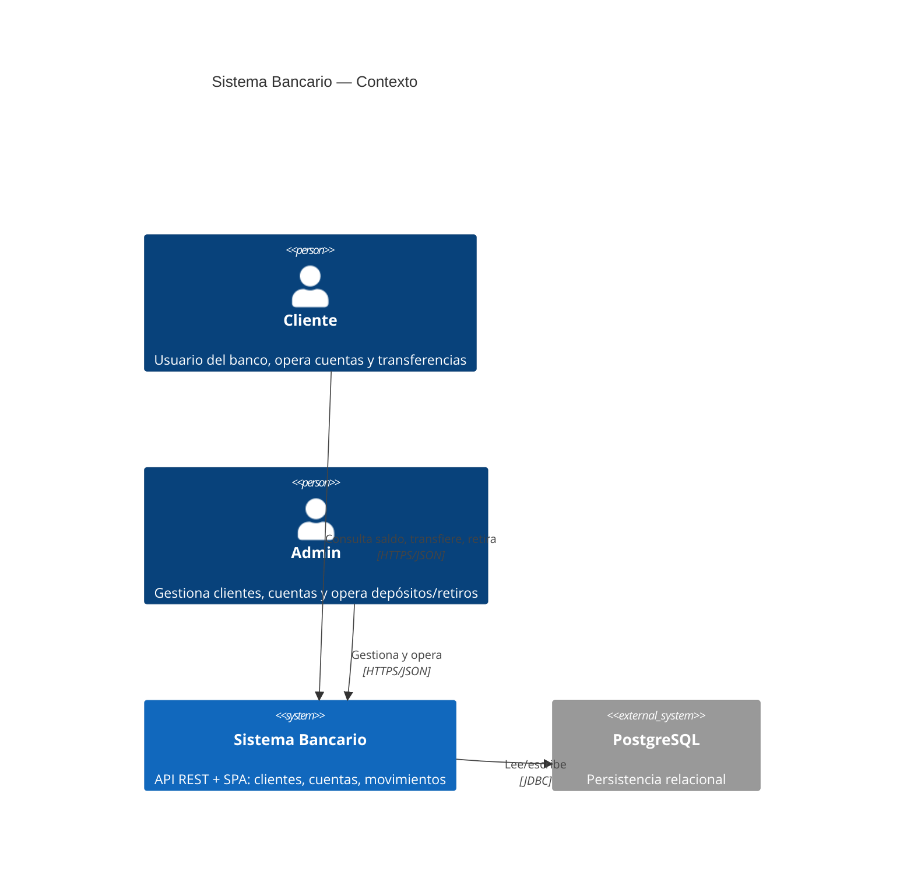
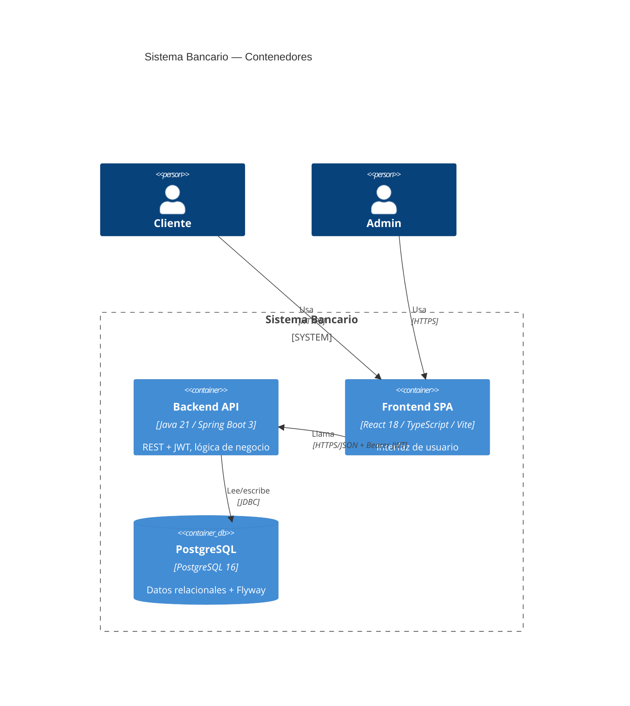

# ARCHITECTURE.md — Sistema Bancario

Documento de referencia para el stack, las capas, el modelo de dominio y los
patrones aplicados. Es fuente de verdad para los agentes SDD (junto con
`AGENTS.md` y los ADRs).

---

## 1. Visión general

Sistema bancario de portfolio: gestión de clientes, cuentas, movimientos,
transferencias, depósitos/retiros y autenticación con roles.

Decisiones de alto nivel (detalladas en ADRs):

- **Monolito modular** (no microservicios) — ADR-001.
- **Arquitectura hexagonal + DDD táctico** — ADR-001.
- **PostgreSQL + Flyway** — ADR-002.
- **Spring Security + JWT (RBAC)** — ADR-003.

### Diagrama C4 — Contexto



### Diagrama C4 — Contenedores



---

## 2. Capas (hexagonal + DDD)

```
                   ┌──────────────────────────────────────────┐
  REST/Web  ──────▶│  infrastructure.adapter.web  (controllers)│
  JPA       ◀──────│  infrastructure.adapter.persistence        │
  Security  ◀──────│  infrastructure.security / config          │
                   └───────────────┬──────────────────────────┘
                                   │ implementa puertos
                   ┌───────────────▼──────────────────────────┐
                   │  application (use cases, validación)     │
                   └───────────────┬──────────────────────────┘
                                   │ usa
                   ┌───────────────▼──────────────────────────┐
                   │  domain (entidades, VOs, puertos, eventos)│
                   │        NO depende de Spring/frameworks    │
                   └──────────────────────────────────────────┘
```

### Reglas de dependencia (enforced con ArchUnit)

1. `domain` no depende de nada del proyecto ni de Spring/JPA.
2. `application` depende solo de `domain`.
3. `infrastructure` depende de `application` y `domain` (implementa los puertos).
4. `infrastructure` es la única capa que conoce Spring, JPA y controllers.

La verificación automática vive en `backend/src/test/java/com/banco/architecture/`.

---

## 3. Estructura de paquetes (backend)

```
com.banco
├── domain
│   ├── model        # Cliente, Cuenta, Movimiento, Usuario (agregados/entidades)
│   ├── vo           # Money, CBU, DNI, Moneda (value objects inmutables)
│   ├── port         # interfaces: ClienteRepository, CuentaRepository, ...
│   ├── event        # TransferenciaRealizada, DepositoRealizado, RetiroRealizado
│   └── exception    # SaldoInsuficienteException, CuentaNoEncontradaException, ...
├── application
│   ├── command      # TransferirCommand, DepositarCommand, RetirarCommand, ...
│   ├── query        # ObtenerExtractoQuery, ObtenerSaldoQuery, ...
│   ├── usecase      # servicios de aplicación (orquestan dominio)
│   └── validator    # Chain of Responsibility de validación
└── infrastructure
    ├── adapter
    │   ├── persistence   # entidades JPA + repositorios (implementan puertos)
    │   └── web           # controllers REST + DTOs de entrada/salida
    ├── security          # JwtService, SecurityConfig, filtros, UserDetails
    └── config            # beans de configuración
```

---

## 4. Modelo de dominio

### Entidades y agregados

| Agregado | Entidad raíz | Regla principal |
| --- | --- | --- |
| `Cliente` | `Cliente` | `DNI` único; un cliente posee N cuentas |
| `Cuenta` | `Cuenta` | `CBU` único; saldo nunca negativo; estado `ACTIVA`/`BLOQUEADA` |
| `Movimiento` | (parte de `Cuenta`) | registra cada operación con monto y contraparte |

### Value Objects (inmutables)

| VO | Descripción |
| --- | --- |
| `Money` | `BigDecimal` + `Currency`; operaciones aritméticas encapsuladas (sin mutación) |
| `CBU` | número de cuenta validado (longitud/dígitos) |
| `DNI` | documento validado (solo dígitos, longitud) |

### Relaciones

```
Cliente (1) ──── (N) Cuenta (1) ──── (N) Movimiento
Usuario  (1) ──── (0..1) Cliente      # un CLIENTE puede estar vinculado a una persona
```

- `Usuario.rol ∈ { CLIENTE, ADMIN }`.
- `Usuario` con rol `CLIENTE` se vincula a un `Cliente` para operar sus cuentas.

### Tipos de operación (Movimiento)

`DEPOSITO`, `RETIRO`, `TRANSFERENCIA_ENTRANTE`, `TRANSFERENCIA_SALIENTE`.

---

## 5. Patrones de diseño aplicados

| Patrón | Dónde | Notas |
| --- | --- | --- |
| Value Object | `Money`, `CBU`, `DNI` | inmutables, validan en constructor |
| Aggregate Root | `Cuenta` | único punto de mutación del saldo |
| Repository (puerto) | `domain.port` | interfaz en dominio, impl JPA en infra |
| Factory | creación de `Cuenta` por tipo | `CajaAhorro` / `CuentaCorriente` |
| Strategy | comisiones/reglas por tipo de cuenta | Open/Closed |
| Chain of Responsibility | `application.validator` | valida en orden y corta ante fallo |
| Domain Events + Observer | `domain.event` | desacopla auditoría/notificación |
| Unit of Work + optimistic lock | `@Version` en `Cuenta` | evita race conditions en transferencias |
| Adapter | puertos ↔ adaptadores | hexagonal |
| CQRS (ligero) | `command` vs `query` | separa escritura de lectura |

---

## 6. Transferencias (caso crítico)

Una transferencia es **transaccional y atómica**:

1. Validar (chain): cuenta origen activa → saldo suficiente → límite diario →
   cuenta destino válida.
2. Debitar origen y acreditar destino en la **misma transacción**.
3. Registrar dos `Movimiento` (saliente + entrante).
4. Emitir `TransferenciaRealizada`.
5. Si hay concurrencia, `@Version` dispara `OptimisticLockException` y se
   reintenta o rechaza (nunca se pierde consistencia de saldo).

`Money` usa `BigDecimal` y todas las operaciones monetarias redondean con un
`MathContext` explícito (sin `double`).

---

## 7. API REST

Convenciones:

- `/api/v1/clientes`, `/api/v1/cuentas`, `/api/v1/movimientos`,
  `/api/v1/transferencias`, `/api/v1/auth`.
- Autenticación: `Authorization: Bearer <JWT>`.
- Errores: envelope JSON estándar (`{ code, message, details? }`) con códigos
  HTTP correctos (400 validación, 401/403 auth, 404 no encontrado,
  409 conflicto/concurrencia, 422 regla de negocio).
- Los DTOs viven en `infrastructure.adapter.web`; el dominio nunca expone DTOs.

---

## 8. Seguridad

- JWT firmado (HS256) con expiración corta.
- Roles `CLIENTE` / `ADMIN` (RBAC) verificados server-side en cada endpoint.
- Passwords con **BCrypt**.
- Un `CLIENTE` solo puede operar sus propias cuentas (verificación de
  propiedad en la capa de aplicación).

---

## 9. Persistencia

- PostgreSQL 16 (docker-compose, puerto `5433` en local).
- Migraciones Flyway en `backend/src/main/resources/db/migration/`
  (`V1__schema_inicial.sql`, ...).
- `@Version` en `Cuenta` para optimistic locking.
- Sin lógica de negocio en migraciones ni en mapeos JPA.

---

## 10. Testing

| Capa | Tipo | Herramienta |
| --- | --- | --- |
| dominio / aplicación | unit | JUnit 5 + Mockito |
| integración | integración | Spring Boot Test + Testcontainers (Postgres real) |
| arquitectura | enforcement | ArchUnit (`mvn verify`) |
| (opcional) negocio | BDD | Cucumber |

Ver `AGENTS.md` §12 y §20 para los comandos.
